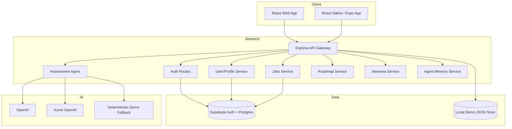

# Avora - AI Career Copilot for People with Disabilities

An AI-powered career platform that helps people with disabilities move from self-discovery to accessible job preparation, learning roadmaps, mock interviews, and confidence coaching.


## Vision

Break down barriers in career exploration and job preparation through AI-powered personalization, accessible content, practical learning plans, and disability-aware support.

Avora is built around one core idea: career tools should adapt to the user, not force every user through the same generic path.

## Key Features

| Feature | Description |
| --- | --- |
| Disability-aware AI | AI agents consider accessibility preferences, work style, disclosure comfort, and support needs. |
| Career assessment | Conversation-based assessment that turns goals, skills, and job targets into practical next steps. |
| Job analysis | Compares a role or job description against the user's profile and highlights skill gaps. |
| Personalized roadmaps | Builds weekly learning plans with concrete outputs and accessible pacing. |
| Smart mock interview | Creates job-specific interview practice with structured feedback and disclosure coaching. |
| Confidence builder | Supports self-esteem, reflection, and progress tracking throughout the career journey. |
| Partner inquiry flow | Lets employers, schools, NGOs, and technology partners contact the Avora team. |
| Local demo fallback | Runs locally without production Supabase or AI keys, while keeping a production path ready. |

## Architecture



## Current Status

This repository is a submission-ready local MVP. The core web product runs end to end with:

- Email register, login, forgot password, and reset password.
- Local demo persistence for users, profiles, saved jobs, and agent memory.
- Supabase production schema and service-role backend integration.
- AI provider support for OpenAI and Azure OpenAI.
- Demo fallback mode when real AI keys are not configured.
- Career assessment, job analysis, roadmaps, mock interviews, confidence coaching, and partner inquiry handling.
- Browser accessibility smoke coverage for desktop and mobile pages.

Production release still requires real deployment credentials, deployed domains, CORS/OAuth redirect configuration, Redis-backed rate limiting, email delivery keys, and final manual accessibility QA.

## Tech Stack

### Frontend

- Web: React 18, Vite, TypeScript, Tailwind CSS
- State: Zustand, React Query
- Routing: React Router 6
- UI: Lucide icons, custom accessible components
- Mobile: React Native / Expo scaffold

### Backend

- Runtime: Node.js 20
- Framework: Express.js + TypeScript
- Auth: Supabase Auth in production, local JWT demo fallback
- AI: OpenAI, Azure OpenAI, deterministic local fallback
- Email: Resend for partner inquiries
- Rate limiting: memory or Redis-backed express-rate-limit

### Data & Storage

- Production database: Supabase Postgres
- Production auth: Supabase Auth
- Local demo store: JSON file persistence
- Agent memory: Supabase table or local demo store

### Tooling

- Package manager: pnpm 9.15.4
- Monorepo orchestration: Turbo
- Tests: Vitest, Playwright, Node smoke tests
- Deploy targets: Vercel/Netlify for web, Render/Railway/Fly/Azure App Service for API

## Getting Started

### Prerequisites

- Node.js 20 or newer
- pnpm 9.15.4
- PowerShell on Windows, or any shell on macOS/Linux

Enable pnpm with Corepack:

```powershell
corepack enable
corepack prepare pnpm@9.15.4 --activate
```

If Windows has registry certificate errors:

```powershell
$env:NODE_OPTIONS='--use-system-ca'
```

### Installation

```powershell
git clone https://github.com/Vanduc127845/Avora-main.git
cd Avora-main
pnpm install
Copy-Item .env.example .env
```

For local demo mode, you can run without Supabase and without AI provider keys. Avora will use local demo auth and fallback AI.

## Configuration

Create a `.env` file from `.env.example`.

### Local demo essentials

```env
NODE_ENV=development
PORT=4000
JWT_SECRET=change-this-secret
CORS_ORIGIN=http://localhost:3000,http://127.0.0.1:3000
FRONTEND_URL=http://localhost:3000
DEMO_DATA_FILE=./data/demo-db.json
AUTH_PASSWORD_RESET_DRY_RUN=true

VITE_API_URL=http://localhost:4000
VITE_APP_NAME=Avora
AI_ENABLE_DEMO_FALLBACK=true
PARTNER_INQUIRY_DRY_RUN=true
```

### OpenAI provider

```env
AI_PROVIDER=openai
OPENAI_API_KEY=sk-your-key
OPENAI_MODEL=gpt-4o-mini
OPENAI_BASE_URL=https://api.openai.com/v1
```

### Azure OpenAI provider

```env
AZURE_OPENAI_ENDPOINT=https://your-resource.openai.azure.com/
AZURE_OPENAI_API_KEY=your-key
AZURE_OPENAI_DEPLOYMENT=your-deployment-name
AZURE_OPENAI_API_VERSION=2024-02-15-preview
```

### Supabase production

```env
SUPABASE_URL=https://your-project.supabase.co
SUPABASE_SERVICE_KEY=your-service-role-key
SUPABASE_ANON_KEY=your-anon-key
VITE_SUPABASE_URL=https://your-project.supabase.co
VITE_SUPABASE_ANON_KEY=your-anon-key
```

Run `infra/supabase/free-mvp-schema.sql` in the Supabase SQL editor before connecting production traffic.

## Development

Start the API:

```powershell
pnpm --filter @ai4a/api-gateway dev
```

Start the web app:

```powershell
pnpm --filter @ai4a/web dev
```

Open:

```text
http://localhost:3000
```

Health checks:

```powershell
Invoke-WebRequest http://localhost:4000/health
Invoke-WebRequest http://localhost:4000/ready
Invoke-WebRequest http://localhost:4000/api/ai/status
```

## Build

```powershell
# Build all workspaces
pnpm build

# Build shared package
pnpm --filter @ai4a/shared build

# Build web app
pnpm --filter @ai4a/web build

# Build API gateway
pnpm --filter @ai4a/api-gateway build
```

## Test

```powershell
# Unit tests
pnpm --filter @ai4a/tests test

# Auth smoke test
pnpm test:e2e:auth

# Assessment role smoke test
pnpm test:e2e:assessment

# Career workflow smoke test
pnpm test:e2e:career

# Browser accessibility smoke test
pnpm test:e2e:browser
```

The browser accessibility smoke test checks Dashboard, Profile, Assessment, Jobs, Roadmaps, Interviews, Confidence, and Simulation on desktop and mobile viewports.

## Project Structure

```text
Avora-main/
|-- apps/
|   |-- web/                 # React web application
|   `-- mobile/              # React Native / Expo scaffold
|-- packages/
|   `-- shared/              # Shared types, constants, and helpers
|-- services/
|   |-- api-gateway/         # Express API gateway
|   `-- ai-service/          # AI service scaffold
|-- tests/
|   |-- e2e/                 # Node and Playwright smoke tests
|   `-- src/                 # Vitest unit tests
|-- infra/
|   |-- supabase/            # Supabase MVP schema
|   |-- terraform/           # Terraform scaffold
|   `-- bicep/               # Azure Bicep scaffold
|-- docs/
|   `-- production-checklist.md
|-- docker-compose.yml
|-- package.json
|-- pnpm-workspace.yaml
`-- README.md
```

## Modules Overview

### 1. User Profile & Accessibility

- Multi-step profile onboarding
- Disability profile and accommodation settings
- Work preferences and target roles
- Privacy settings and account controls

### 2. Career Assessment

- Conversation-based assessment
- Role and JD analysis
- Skill gap detection
- Role baseline analysis when the user gives a target role but no JD
- Agent traces for Profile, Jobs, Roadmaps, and Interviews

### 3. Jobs

- Accessible job search
- Job detail pages
- Job fit analysis against user profile
- Save and unsave jobs
- One-click action plan for roadmap and interview creation

### 4. Roadmaps

- Weekly learning phases
- Skill gap driven milestones
- Progress tracking
- Output-focused learning tasks

### 5. Mock Interview

- Job-specific question generation
- AI interviewer turn replies
- Structured answer feedback
- Accessibility-aware interview support

### 6. Confidence

- Reflection prompts
- Confidence coaching
- Local progress history
- Practical next-step support

### 7. Simulation

- Career scenario practice
- Workplace decision prompts
- Reflection history
- Reduced-motion friendly UI

### 8. Partners

- Partner inquiry form
- Backend validation
- Resend email delivery
- Safe dry-run mode for demos

## API Documentation

### Health and readiness

```text
GET /health
GET /ready
GET /api/ai/status
```

### Authentication

```text
POST /api/auth/register
POST /api/auth/login
POST /api/auth/forgot-password
POST /api/auth/reset-password
POST /api/auth/logout
GET  /api/auth/oauth/:provider
GET  /api/auth/oauth/:provider/callback
```

### Users

```text
GET    /api/users/profile
PUT    /api/users/profile
DELETE /api/users/account
```

### Assessments

```text
POST /api/assessments
GET  /api/assessments/history
GET  /api/assessments/:id
POST /api/assessments/:id/message
PUT  /api/assessments/:id/complete
```

### Jobs

```text
GET    /api/jobs
GET    /api/jobs/saved
GET    /api/jobs/:id
POST   /api/jobs/:id/analyze
POST   /api/jobs/:id/action-plan
POST   /api/jobs/:id/save
DELETE /api/jobs/:id/save
```

### Roadmaps

```text
GET    /api/roadmaps
POST   /api/roadmaps
GET    /api/roadmaps/:id
PUT    /api/roadmaps/:id
DELETE /api/roadmaps/:id
```

### Interviews

```text
GET  /api/interviews
POST /api/interviews
GET  /api/interviews/:id
POST /api/interviews/:id/answer
POST /api/interviews/:id/complete
```

### AI and memory

```text
POST   /api/ai/chat
GET    /api/agent-memory
DELETE /api/agent-memory/profile
DELETE /api/agent-memory
```

### Partners

```text
POST /api/partner-inquiry
```

## Production Checklist

See [docs/production-checklist.md](docs/production-checklist.md).

Before public launch, confirm:

- Web and API are deployed on final domains.
- `CORS_ORIGIN` and `FRONTEND_URL` match the deployed web URL.
- Supabase OAuth redirect URLs are configured.
- Supabase schema has been applied.
- `/health`, `/ready`, and `/api/ai/status` pass.
- `AI_ENABLE_DEMO_FALLBACK=false` after real AI keys work.
- Partner inquiry email delivery works or dry-run mode is explicitly enabled.
- Browser accessibility smoke tests pass.
- At least one primary flow is manually checked with NVDA, Narrator, or VoiceOver.

## License

MIT
"# AVORA" 
