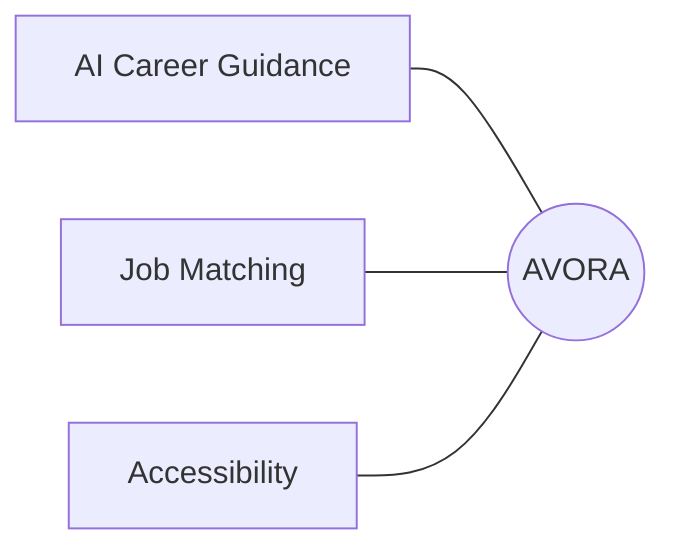
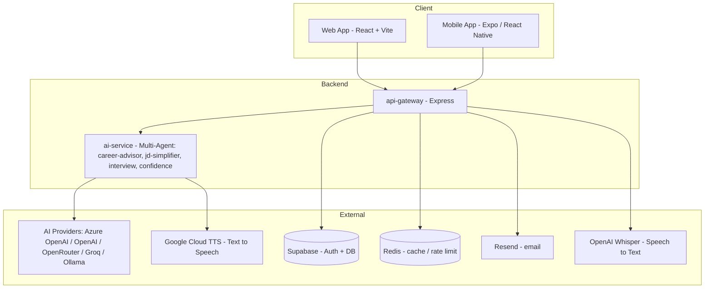

# AVORA — AI Career Copilot for Accessible Employment

> Helping people with disabilities discover their capabilities, understand job descriptions, practice interviews, and build accessible career paths.

## Overview

AVORA is an AI/LLM-powered career assistant platform designed to support people with disabilities throughout their job search and career development journey.

Rather than simply providing a list of job opportunities, AVORA addresses the **entire journey**: capability discovery → job understanding → suitability assessment → career development planning → interview practice. The goal is to help users be evaluated based on their capabilities, strengths, and skills, while providing transparent information about workplace accessibility.

## Problem

Finding a job has never been easy. People with disabilities need more than just a list of job opportunities — they need **guidance**, **easy-to-understand information**, and **a safe environment** to prepare themselves.

| Problem | Details |
| -------------------------------- | --------------------------------------------------------------------------------------------------------------------------- |
| **Unclear career fit** | Difficult to assess strengths, interests, limitations, and support needs independently |
| **Difficult-to-understand JDs** | Job descriptions are often long and contain many technical terms, making it difficult to determine which requirements are truly important |
| **Lack of interview practice** | Few safe spaces are available for practicing before communicating with recruiters |
| **Lack of accessibility signals** | Users do not know whether a company supports remote work, flexible environments, assistive tools, or other suitable working conditions |

Therefore, AVORA does not approach the problem simply from the perspective of "job searching", but instead addresses the broader challenge of **finding a suitable job with long-term growth potential**.

## Target Users

People with disabilities of working age who have learning capabilities and access to an internet-connected device.

**Needs:**

- Access recruitment information without barriers
- Have a clear and feasible career development roadmap
- Have a safe environment to practice interviews and mentally prepare before meeting recruiters

**Core Insights:**

- Want to be evaluated based on intellectual strengths and capabilities — rather than being judged by physical disabilities
- Need transparency from the beginning regarding the working environment (whether flexible work, remote work, or specialized tools are supported)

> *"Don't see me through the lens of pity — give me the opportunity to prove myself."*

## Solution

AVORA (internal technical name: **AI4A** — *AI for Accessibility*) operates as an **AI Career Copilot** — an AI assistant that accompanies users throughout their entire career development journey. The key point is that the system does not simply answer user questions, but instead uses multiple AI components to handle specialized tasks.

### Overall Workflow

```text
User
  → Capability Analysis
  → JD Analysis
  → CV/JD Matching
  → Accessibility Check
  → Career Recommendation
  → Career Roadmap Generation
  → Interview Practice
```

## Four Technology Pillars

### 1. AI & Natural Language Processing

LLMs are used to analyze and extract data, understand Job Descriptions, convert complex JDs into simple language, and standardize job information for subsequent matching and evaluation processes (already implemented in `services/ai-service` — agent `jd-simplifier`).

**Multi-Agent Architecture**: AI is divided into multiple specialized assistants, each with its own context and responsibilities. This helps produce more focused responses instead of relying on a single AI for every function:

- **Career Advisor** (`career-advisor.agent`) — provides career guidance
- **Interview Coach** (`interview.agent`) — acts as a recruiter and supports interview practice
- **JD Simplifier** (`jd-simplifier.agent`) — translates JDs into simple language
- **Confidence Builder** (`confidence.agent`) — provides psychological support and builds confidence

Supports multiple AI providers (Azure OpenAI, OpenAI, OpenRouter, Groq, or locally running Ollama) through the `AI_PROVIDER` variable.

### 2. Decision-Making Algorithms (Matching)

- **Boolean Logic — hard filtering**: checks compatibility between the user's physical capabilities and the company's working conditions/infrastructure, eliminating jobs with unsuitable or unsafe physical requirements
- **Vector Search — fine-grained filtering**: after the hard-filtering stage, evaluates the similarity between the CV ↔ Job Description by representing skills as vectors, calculating similarity scores, and generating matching results based on skill compatibility (`embedding_service.ts`)

### 3. Orchestration (Priority Queue)

**Problem**: A Priority Queue only sorts based on a predefined numerical score, but the definition of "best" differs from person to person with disabilities — some may prioritize remote work, others salary, while others may prioritize distance from home.

**Responsible Model**: Career Advisor Agent (Gemma 3 / 4) — optional, but improves recommendation quality.

The model analyzes conversations with users to infer a personalized set of priority weights, for example: remote weight = 0.5, salary weight = 0.3, distance weight = 0.2. The Priority Queue then uses these weights together with the Vector Search score to calculate the final priority score before sorting jobs at the top of the job feed.

> In short: the Model is the "translator that converts personal preferences into numerical weights"; the Priority Queue is the "sorting mechanism" that uses those numbers.

### 4. Accessibility Infrastructure

- **Speech-to-Text (OpenAI Whisper)**: converts speech into text and supports Vietnamese with high accuracy — helping users with limited mobility enter information and answer interview questions
- **Text-to-Speech (Google Cloud TTS)**: reads job descriptions aloud and provides audio-based interview interactions for visually impaired users

## Key Features

### Capability Map & Adaptive UI

- Perspective transformation: evaluates users based on their strengths (cognitive abilities, visual abilities, etc.) rather than focusing on physical disabilities
- Smart display: automatically adjusts fonts, grid structures, and colors based on the user's accessibility profile

### AI Career Copilot

**Roadmap Generator** — analyzes the gap between the user's current skills and the skills required for their career goal, then generates a personalized learning roadmap:

```text
User wants to become a Backend Developer
  → AVORA analyzes current skills
  → Identifies Skill Gaps
  → Recommends missing knowledge
  → Creates Career Roadmap
  → Tracks development progress
```

**Interview Coach** — AI acts as a recruiter to conduct mock interviews:

```text
AI asks a question → User answers → AI analyzes → Evaluates → Provides feedback → Improves → Continues the interview
```

The goal is not only to evaluate answers, but also to create a safe practice environment that helps users prepare more effectively before real-world interviews.

### Other Product Features

| Feature | Description |
| ------------------------------ | -------------------------------------------------------------------- |
| **JD Translator** | Converts complex job descriptions into simple, easy-to-understand language |
| **Career Simulation** | Provides a trial experience of a job before applying |
| **Confidence Builder** | Builds confidence and psychological resilience throughout the journey |
| **Recruitment Partner Connection** | `partners` module allowing companies to submit partnership requests |

## Differentiation

The biggest differentiator of AVORA is that **Accessibility is integrated directly into the career guidance process**, rather than being treated as an additional feature.

> Instead of evaluating users based on their disabilities, AVORA evaluates them based on their capabilities and seeks to connect those capabilities with a suitable working environment.

AVORA combines three factors to create a more comprehensive career support system:


```mermaid
flowchart LR
    A[AI Career Guidance] --- D((AVORA))
    B[Job Matching] --- D
    C[Accessibility] --- D
```

## Overall Architecture


```mermaid
flowchart TB
    subgraph Client
        WEB[Web App - React + Vite]
        MOBILE[Mobile App - Expo / React Native]
    end

    subgraph Backend
        GATEWAY[api-gateway - Express]
        AISVC[ai-service - Multi-Agent: career-advisor, jd-simplifier, interview, confidence]
    end

    subgraph External
        SUPABASE[(Supabase - Auth + DB)]
        AIPROV[AI Providers: Azure OpenAI / OpenAI / OpenRouter / Groq / Ollama]
        WHISPER[OpenAI Whisper - Speech to Text]
        TTS[Google Cloud TTS - Text to Speech]
        REDIS[(Redis - cache / rate limit)]
        RESEND[Resend - email]
    end

    WEB & MOBILE --> GATEWAY
    GATEWAY --> AISVC
    GATEWAY --> SUPABASE
    GATEWAY --> REDIS
    GATEWAY --> RESEND
    GATEWAY --> WHISPER
    AISVC --> AIPROV
    AISVC --> TTS
```

This is a **monorepo** managed using **pnpm workspaces** + **Turborepo**.

## Technology Stack

### Frontend

- **Web**: React 18 + Vite + TypeScript + Tailwind CSS, React Router 6, TanStack Query, Zustand, i18next (multilingual support, with `vi` / `en` available)
- **Mobile**: Expo (React Native)

### Backend

- **Runtime**: Node.js ≥ 20, TypeScript
- **`services/api-gateway`**: Express.js — auth, users, assessments, jobs, roadmaps, interviews, partners, speech-to-text
- **`services/ai-service`**: Express.js — AI agents following the Multi-Agent architecture (career advisor, JD simplifier, interview, confidence)
- **AI Providers** (selected through the `AI_PROVIDER` variable): Azure OpenAI, OpenAI, OpenRouter, Groq, or Ollama (running locally, with no API key required)
- **Speech-to-text**: OpenAI Whisper (optional)
- **Text-to-speech**: Google Cloud TTS (in development)

### Data & Infrastructure

- **Auth & Database**: Supabase (including Google / Microsoft OAuth)
- **Cache / Rate limit**: Redis (optional, in-memory storage by default)
- **Email**: Resend (for partnership requests from partners)
- **Deployment**: Vercel (web + api-gateway) or Docker / docker-compose; Infrastructure as Code is available through Terraform and Bicep in `infra/`
- **Demo Mode**: `API_DATA_MODE=demo` allows the entire backend to run with sample data (`data/demo-db.json`), without configuring real Supabase/AI services

## Quick Start

### Requirements

- Node.js ≥ 20
- pnpm 9.x (`corepack enable` to use the version specified in `packageManager`)
- Docker (optional, for running through `docker-compose`)

### Installation

```bash
git clone https://github.com/dtung1108ltt-glitch/AVORA.git
cd AVORA

pnpm install

cp .env.example .env
# Edit .env with your Supabase / AI provider information
```

> Want to try it quickly without any API keys? Set `API_DATA_MODE=demo` and `AI_ENABLE_DEMO_FALLBACK=true` as provided by default in `.env.example` — the system will use sample data and demo responses instead of calling a real AI provider.

### Running in Development

```bash
# Run the entire workspace (turbo run dev)
pnpm dev

# Run only the web application
pnpm dev:web

# Run only the mobile application (Expo)
pnpm dev:mobile

# Run only the api-gateway
pnpm dev:api

# Run only the ai-service
pnpm dev:ai
```

By default:

- Web runs at `http://localhost:3000`
- api-gateway runs at `http://localhost:4000`
- Health check endpoint: `GET /health`
- ai-service runs at `http://localhost:4001`

### Build

```bash
pnpm build          # build everything
pnpm build:web
pnpm build:mobile
pnpm build:api
```

### Testing & Linting

```bash
pnpm test            # turbo run test (including Vitest in the tests/ directory)
pnpm test:coverage
pnpm lint
pnpm typecheck
```

### Running with Docker

```bash
docker-compose up --build
```

This starts:

- `api-gateway` (port 4000)
- `ai-service` (port 4001)
- `redis` (port 6379)

The `.env.production` file must be prepared in each service directory.

## Project Structure

```text
AVORA/
├── apps/
│   ├── web/                    # Web application (React + Vite)
│   └── mobile/                 # Mobile application (Expo / React Native)
│
├── packages/
│   └── shared/                 # Shared types & constants (@ai4a/shared)
│
├── services/
│   ├── api-gateway/            # Main API: auth, users, jobs, roadmaps, interviews, partners...
│   └── ai-service/             # Multi-Agent AI: career-advisor, jd-simplifier, interview, confidence
│
├── infra/
│   ├── terraform/              # Infrastructure as Terraform
│   ├── bicep/                  # Azure Bicep infrastructure
│   └── supabase/               # Supabase configuration / migrations
│
├── tests/                      # Shared tests (Vitest)
├── docs/                       # Operational documentation (e.g. production-checklist.md)
├── SPEC.md                     # Detailed technical specification
├── docker-compose.yml
└── turbo.json / pnpm-workspace.yaml
```

## Main Modules (`apps/web/src/modules`)

- **auth** — registration, login, OAuth through Supabase
- **assessment** — self-assessment/self-discovery through AI conversation (foundation for the Capability Map)
- **jobs** — job search, AI-powered JD analysis (JD Translator), Boolean + Vector Search matching
- **roadmaps** — Roadmap Generator: personalized learning roadmap
- **interviews** — Interview Coach: AI mock interviews with voice support (speech-to-text/text-to-speech)
- **confidence** — Confidence Builder
- **simulation** — Career Simulation: simulated work experience
- **profile / settings** — user profile, Adaptive UI / accessibility settings
- **partners** — partnership contact form for companies
- **docs / home** — introduction page, public documentation

## Main APIs (`services/api-gateway/src/routes`)

```text
/api/auth/*          - registration, login, refresh token, user information
/api/users/*         - user profiles
/api/assessments/*   - self-assessment through AI conversation
/api/jobs/*           - AI-powered job search & analysis (JD Translator + matching)
/api/roadmaps/*       - personalized learning roadmap (Roadmap Generator)
/api/interviews/*     - mock interview sessions, Q&A, feedback (Interview Coach)
/api/partners/*       - partnership requests
/speech-to-text/*     - speech-to-text conversion (Whisper)
```

## Accessibility

The project aims to support:

- **WCAG 2.1** Level AA
- Screen reader support and keyboard navigation
- High-contrast mode, adjustable font sizes, and Adaptive UI based on user profiles
- Reduced motion mode
- Voice input/output (Speech-to-Text / Text-to-Speech) for users with limited mobility or visual impairments

## Contributing

1. Fork and clone the repository
2. Create a feature branch: `git checkout -b feature/feature-name`
3. Install dependencies and run tests: `pnpm install && pnpm test`
4. Commit, push, and open a Pull Request

Please follow the existing ESLint/Prettier configuration (`pnpm lint`, `pnpm format`).

## License

Released under the MIT License — see the `LICENSE` file (if available) for details.

---

Built with ❤️ for a kinder, more innovative society — for the disability community.
