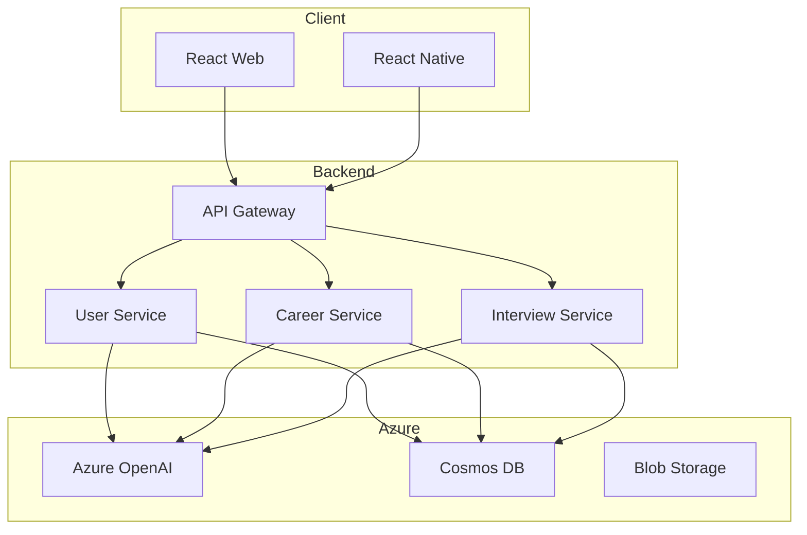

# Avora - AI Career Copilot for Disabled
            
> An AI-powered platform helping people with disabilities navigate their career journey from self-discovery to employment.


## Vision

Breaking down barriers in career exploration and job application for people with disabilities through AI-powered personalization, accessible content, and practical tools.

## Key Features

| Feature | Description |
|---------|-------------|
| **Disability-Aware AI** | AI that understands and respects each user's unique situation |
| **JD Translator** | Converts complex job descriptions into plain, accessible language |
| **Personalized Roadmaps** | AI-generated learning paths tailored to individual needs |
| **Smart Mock Interview** | Practice with AI feedback and disability disclosure coaching |
| **Career Simulation** | Experience jobs before applying |
| **Confidence Builder** | Build self-esteem and resilience throughout the journey |

## Architecture


```mermaid
flowchart TB
    subgraph Client
        WEB[React Web]
        MOBILE[React Native]
    end

    subgraph Azure
        AOAI[Azure OpenAI]
        COSMOS[Cosmos DB]
        BLOB[Blob Storage]
    end

    subgraph Backend
        API[API Gateway]
        USER[User Service]
        CAREER[Career Service]
        INTERVIEW[Interview Service]
    end

    WEB & MOBILE --> API
    API --> USER & CAREER & INTERVIEW
    USER & CAREER & INTERVIEW --> AOAI
    USER & CAREER & INTERVIEW --> COSMOS
```

## Tech Stack

### Frontend
- **Web**: React 18 + Vite + TypeScript + Tailwind CSS
- **Mobile**: React Native (Expo)
- **State**: Zustand
- **Routing**: React Router 6

### Backend
- **Runtime**: Node.js 20 LTS
- **Framework**: Express.js + TypeScript
- **AI**: Azure OpenAI Service (GPT-4o)
- **Speech**: Azure AI Speech

### Data & Storage
- **Primary DB**: Azure Cosmos DB
- **Relational**: Azure SQL
- **Files**: Azure Blob Storage
- **Cache**: Azure Redis

### Infrastructure
- **Hosting**: Azure App Service
- **Auth**: Azure AD B2C
- **CI/CD**: Azure DevOps / GitHub Actions

## Getting Started

### Prerequisites

- Node.js 20.x
- npm 10.x or yarn 1.22+
- Docker (optional)
- Azure account (for AI services)

### Installation

```bash
# Clone the repository
git clone https://github.com/your-org/avora.git
cd avora

# Install dependencies
npm install

# Copy environment file
cp .env.example .env

# Edit .env with your Azure credentials
```

### Configuration

Create a `.env` file:

```env
# Azure OpenAI
AZURE_OPENAI_ENDPOINT=https://your-resource.openai.azure.com/
AZURE_OPENAI_API_KEY=your-api-key
AZURE_OPENAI_DEPLOYMENT=gpt-4o

# Azure Cognitive Services
AZURE_SPEECH_KEY=your-speech-key
AZURE_SPEECH_REGION=eastus

# Database
COSMOS_DB_CONNECTION_STRING=your-connection-string

# Auth
AZURE_AD_TENANT_ID=your-tenant-id
AZURE_AD_CLIENT_ID=your-client-id
```

### Development

```bash
# Start all services
npm run dev

# Start only web app
npm run dev:web

# Start only backend
npm run dev:api

# Start mobile app
npm run dev:mobile
```

### Build

```bash
# Build all packages
npm run build

# Build web app
npm run build:web

# Build mobile app
npm run build:mobile
```

### Test

```bash
# Run all tests
npm test

# Run with coverage
npm run test:coverage

# Run e2e tests
npm run test:e2e
```

## Project Structure

```
avora/
├── apps/
│   ├── web/                    # React web application
│   └── mobile/                 # React Native mobile app
│
├── packages/
│   └── shared/                 # Shared types and utilities
│
├── services/
│   ├── api-gateway/            # Express.js API gateway
│   ├── ai-service/             # Azure OpenAI integration
│   ├── user-service/           # User management
│   ├── career-service/         # Career matching
│   └── interview-service/      # Mock interviews
│
├── infra/
│   ├── bicep/                  # Azure infrastructure
│   └── terraform/              # Alternative IaC
│
└── tests/
    ├── unit/                   # Unit tests
    ├── integration/            # Integration tests
    └── e2e/                    # E2E tests
```

## Modules Overview

### 1. User Profile & Accessibility
- Multi-step onboarding wizard
- Disability type and accommodation settings
- Privacy controls
- Adaptive UI (font scaling, contrast, voice navigation)

### 2. Self-Discovery & Career Matching
- AI conversation-based assessment
- Disability-inclusive skill mapping
- Personalized career recommendations
- Role model success stories

### 3. JD Translator
- Plain language conversion (grade 4-12 reading levels)
- Visual job breakdown
- Accessibility analysis
- Task difficulty filtering

### 4. Roadmap Generator
- Gap analysis between current and target skills
- Microlearning paths
- Accommodations per learning item
- Progress tracking with milestones

### 5. Mock Interview
- Voice/text interface
- AI-generated questions
- Real-time feedback
- Disability disclosure coaching
- Accessibility accommodations

### 6. Career Simulation
- Day-in-the-life scenarios
- Task try-outs
- Workplace accessibility ratings
- Mentor shadowing connections

### 7. Confidence Builder
- Positive reinforcement
- Imposter syndrome support
- Success journal
- Community connections

## API Documentation

### Authentication
```
POST /api/auth/register    - Register new user
POST /api/auth/login       - Login
POST /api/auth/refresh    - Refresh token
GET  /api/auth/me         - Get current user
```

### User Profile
```
GET  /api/users/profile          - Get profile
PUT  /api/users/profile          - Update profile
PUT  /api/users/accessibility    - Update accessibility settings
```

### Assessment
```
POST /api/assessments           - Start assessment
POST /api/assessments/:id/chat  - Continue conversation
PUT  /api/assessments/:id/done - Complete assessment
```

### Jobs
```
GET  /api/jobs                  - Search jobs
GET  /api/jobs/:id              - Job details
POST /api/jobs/:id/analyze      - AI analysis
```

### Roadmaps
```
GET  /api/roadmaps             - Get user's roadmaps
POST /api/roadmaps             - Create roadmap
PUT  /api/roadmaps/:id         - Update roadmap
```

### Interviews
```
POST /api/interviews           - Create session
POST /api/interviews/:id/ask   - Get next question
POST /api/interviews/:id/answer - Submit answer
GET  /api/interviews/:id/feedback - Get feedback
```

## Accessibility Standards

This project targets:
- **WCAG 2.1** Level AA compliance
- **Section 508** compliance
- **ADA** Title I/III compliance

### Features Implemented
- Screen reader optimization
- Keyboard navigation
- High contrast mode
- Font scaling (100-200%)
- Reduced motion option
- Voice input/output
- Extra time accommodations

## Contributing

We welcome contributions! Please see [CONTRIBUTING.md](CONTRIBUTING.md) for guidelines.

### Development Setup

```bash
# Fork and clone
git clone https://github.com/your-fork/avora.git

# Create feature branch
git checkout -b feature/your-feature

# Make changes and test
npm test

# Commit and push
git commit -m "Add your feature"
git push origin feature/your-feature

# Open PR
```

## License

This project is licensed under the MIT License - see [LICENSE](LICENSE) for details.

## Support

- **Documentation**: [docs.avora.com](https://docs.avora.com)
- **Issue Tracker**: [GitHub Issues](https://github.com/your-org/avora/issues)
- **Email**: support@avora.com

## Acknowledgments

- Microsoft Azure for AI services
- Open Source community
- Disability advocacy organizations
- All contributors and beta testers

---

Built with ❤️ for the disability community
"# avora-1" 
