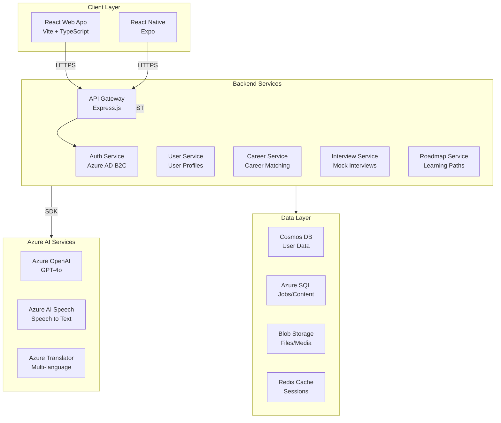
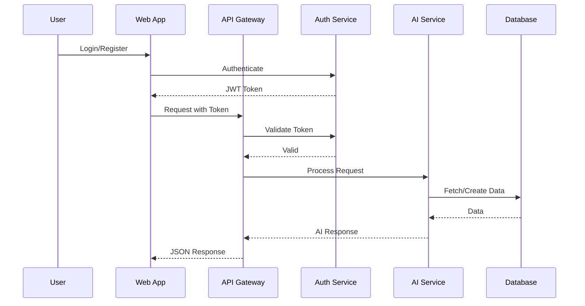
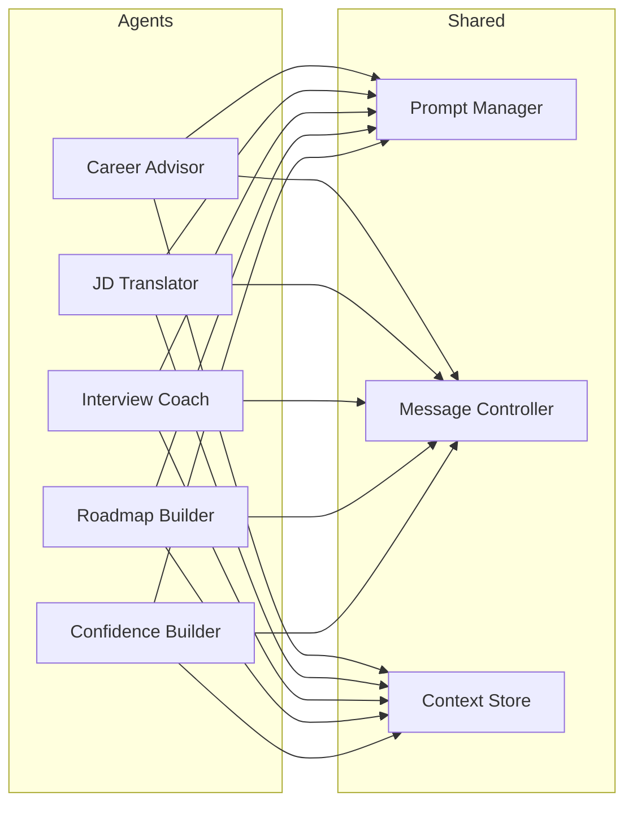
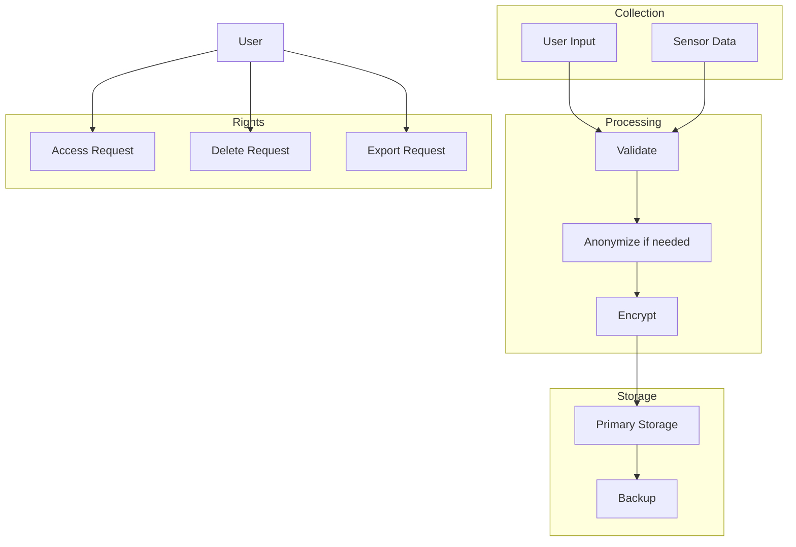
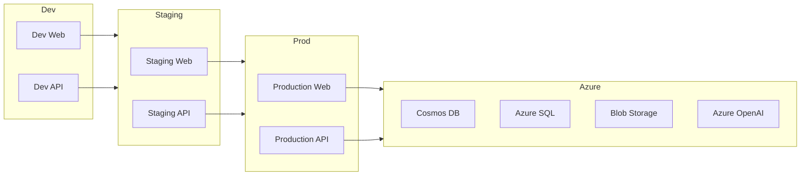

# AI Career Copilot for Disabled - Technical Specification

**Version**: 1.0.0  
**Last Updated**: 2026-04-23  
**Status**: Draft

---

## Table of Contents

1. [Project Overview](#1-project-overview)
2. [Architecture](#2-architecture)
3. [Tech Stack](#3-tech-stack)
4. [Core Features](#4-core-features)
5. [Data Models](#5-data-models)
6. [API Specification](#6-api-specification)
7. [AI Integration](#7-ai-integration)
8. [Security & Privacy](#8-security--privacy)
9. [Accessibility Standards](#9-accessibility-standards)
10. [Deployment](#10-deployment)
11. [Development Guidelines](#11-development-guidelines)

---

## 1. Project Overview

### 1.1 Project Name
**AI Career Copilot for Disabled** (AI4A)

### 1.2 Vision
A comprehensive AI-powered platform that helps people with disabilities navigate their career journey from self-discovery to employment, with a focus on accessibility, personalization, and empowerment.

### 1.3 Mission
Break down barriers in career exploration and job application for people with disabilities by leveraging AI to provide personalized guidance, accessible content, and practical tools.

### 1.4 Target Users
- People with disabilities seeking career guidance
- Vocational rehabilitation counselors
- Disability employment specialists
- HR professionals hiring candidates with disabilities

### 1.5 Key Differentiators
| Feature | Traditional Career Sites | AI4A |
|---------|-------------------------|------|
| Disability Understanding | Generic | AI-powered personal profiling |
| Job Description | Complex jargon | Plain language + accessibility analysis |
| Career Path | One-size-fits-all | Personalized roadmap |
| Interview Practice | Generic questions | Context-aware with disability coaching |
| Career Simulation | None | Immersive experience |

---

## 2. Architecture

### 2.1 High-Level Architecture



### 2.2 Microservices Architecture

```
┌─────────────────────────────────────────────────────────────┐
│                        API Gateway                          │
│                   (Express.js + TypeScript)                 │
└─────────────────────┬─────────────────────────────────────┘
                      │
    ┌─────────────────┼─────────────────┬──────────────────┐
    │                 │                 │                  │
    ▼                 ▼                 ▼                  ▼
┌────────┐      ┌──────────┐      ┌───────────┐      ┌───────────┐
│  User  │      │ Career   │      │ Interview │      │ Roadmap   │
│ Service│      │ Service  │      │ Service   │      │ Service   │
└────────┘      └──────────┘      └───────────┘      └───────────┘
    │                 │                 │                  │
    └─────────────────┴────────┬────────┴──────────────────┘
                               │
                    ┌──────────▼──────────┐
                    │    AI Service       │
                    │  (Azure OpenAI)     │
                    └────────────────────┘
```

### 2.3 Data Flow



---

## 3. Tech Stack

### 3.1 Frontend

| Layer | Technology | Version |
|-------|------------|---------|
| Web Framework | React | 18.x |
| Build Tool | Vite | 5.x |
| Mobile | React Native (Expo) | Latest |
| State Management | Zustand | 4.x |
| Routing | React Router | 6.x |
| Styling | Tailwind CSS | 3.x |
| Forms | React Hook Form | 7.x |
| HTTP Client | Axios | 1.x |
| i18n | i18next | 23.x |

### 3.2 Backend

| Layer | Technology | Version |
|-------|------------|---------|
| Runtime | Node.js | 20.x LTS |
| Framework | Express.js | 4.x |
| Language | TypeScript | 5.x |
| AI SDK | Azure OpenAI SDK | Latest |
| ORM | Prisma | 5.x |
| Validation | Zod | 3.x |
| Logging | Winston | 3.x |
| Rate Limiting | express-rate-limit | 7.x |

### 3.3 Data & Storage

| Service | Purpose |
|---------|---------|
| Azure Cosmos DB | User profiles, sessions, assessments |
| Azure SQL | Jobs, content, roadmaps |
| Azure Blob Storage | CVs, recordings, images |
| Azure Redis Cache | Session cache, rate limiting |
| Azure Search | Job search indexing |

### 3.4 Infrastructure

| Service | Purpose |
|---------|---------|
| Azure App Service | Web hosting |
| Azure Container Apps | Microservices |
| Azure AD B2C | Authentication |
| Azure Monitor | Observability |
| Azure DevOps | CI/CD |

---

## 4. Core Features

### 4.1 Module Overview

| Module | Priority | Description |
|--------|----------|-------------|
| User Profile & Accessibility | P0 | User onboarding, accessibility settings |
| Self-Discovery & Career Matching | P0 | AI assessment, career recommendations |
| JD Translator | P0 | Job description simplification |
| Roadmap Generator | P1 | Personalized learning paths |
| Mock Interview | P1 | AI-powered interview practice |
| Career Simulation | P2 | Virtual job experience |
| Confidence Builder | P2 | Motivation and support |

### 4.2 Module: User Profile & Accessibility

#### Features
1. **Accessibility Profile Setup**
   - Multi-step onboarding wizard
   - Disability type selection (motor, visual, auditory, cognitive, etc.)
   - Severity level assessment
   - Accommodation needs inventory
   - Privacy controls

2. **Adaptive UI Engine**
   - Dynamic font scaling (100% - 200%)
   - High contrast mode
   - Reduced motion option
   - Voice navigation commands
   - Keyboard-only navigation
   - Screen reader optimization

3. **Assistive Technology Integration**
   - Screen reader compatibility (NVDA, JAWS, VoiceOver)
   - Switch access support
   - Eye-tracking input support
   - Voice control commands

#### User Flow
```
Onboarding Start
    │
    ▼
Select Language ──► Language Selection
    │
    ▼
Accessibility Profile ──► Disability Type
    │                       │
    │                       ▼
    │                   Severity Level
    │                       │
    │                       ▼
    │                   Accommodation Needs
    │                       │
    ▼                       ▼
Skip or Continue ──────────►
    │
    ▼
Profile Complete
```

### 4.3 Module: Self-Discovery & Career Matching

#### Features
1. **AI Conversation Assessment**
   - Natural language conversation (not forms)
   - Interest mapping
   - Skills identification
   - Values clarification
   - Work environment preferences

2. **Disability-Inclusive Skill Mapping**
   - Traditional skills translation
   - Disability-specific strengths identification
   - Adaptive skill recognition
   - Assistive technology proficiency

3. **Career Recommendations**
   - Matching algorithm
   - Accessibility factor consideration
   - Market demand analysis
   - Growth potential scoring

4. **Role Model Stories**
   - Success stories database
   - Filter by disability type
   - Industry filtering
   - Video testimonials

#### AI Conversation Flow
```
User: "I'm interested in helping people but also enjoy working with computers"
    │
    ▼
AI Agent: Extracts keywords → identifies interest clusters
    │
    ▼
AI Agent: Asks follow-up questions based on keywords
    │
    ▼
AI Agent: Builds user profile from conversation
    │
    ▼
AI Agent: Matches profile with career database
    │
    ▼
AI Agent: Presents top 5 career matches with reasoning
```

### 4.4 Module: JD Translator

#### Features
1. **Plain Language Mode**
   - Jargon-to-plain-language conversion
   - Reading level adjustment (Grade 4-12)
   - Visual definitions for complex terms

2. **Visual Job Breakdown**
   - Infographic summary
   - Skill requirement visualization
   - Growth path diagram
   - Salary range display

3. **Accessibility Analysis**
   - Remote work potential score
   - Physical demands assessment
   - Accommodation likelihood
   - Workplace accessibility rating

4. **Task Analysis**
   - Task breakdown by difficulty
   - Accommodation suggestions per task
   - Alternative task identification
   - Skill transfer mapping

#### Output Schema
```typescript
interface JDAnalysis {
  summary: {
    plainLanguage: string;
    readingLevel: number; // 1-12
    confidence: number; // 0-1
  };
  keyResponsibilities: {
    original: string;
    simplified: string;
    difficulty: 'easy' | 'medium' | 'hard';
    accommodationPossible: boolean;
  }[];
  skills: {
    name: string;
    importance: 'required' | 'preferred' | 'nice-to-have';
    transferable: boolean;
  }[];
  accessibility: {
    remotePotential: number; // 0-100
    physicalDemands: 'minimal' | 'moderate' | 'significant';
    accommodationScore: number; // 0-100
    barriers: string[];
    suggestions: string[];
  };
  compensation: {
    range: { min: number; max: number };
    currency: string;
    benchmark: number; // percentile
  };
}
```

### 4.5 Module: Roadmap Generator

#### Features
1. **Gap Analysis**
   - Current skills assessment
   - Target job requirements
   - Gap quantification
   - Priority ranking

2. **Microlearning Paths**
   - Bite-sized lessons (5-15 min)
   - Multiple learning formats (video, text, interactive)
   - Progress tracking
   - Spaced repetition

3. **Accommodation Strategies**
   - Per-lesson accommodation suggestions
   - Alternative resource suggestions
   - Flexible pacing options

4. **Timeline Builder**
   - Drag-and-drop scheduling
   - Milestone setting
   - Deadline reminders
   - Progress celebrations

### 4.6 Module: Mock Interview

#### Features
1. **Interview Configuration**
   - Job type selection
   - Difficulty level
   - Question types (behavioral, technical, situational)
   - Time limits

2. **AI Interviewer**
   - Natural conversation
   - Follow-up questions
   - Scenario-based questions
   - Disability-specific questions

3. **Accessibility Accommodations**
   - Extra time option
   - Text-based alternative
   - Break scheduling
   - Question rephrasing

4. **Feedback System**
   - Real-time feedback
   - Final summary report
   - Specific improvement suggestions
   - Positive reinforcement

5. **Disability Disclosure Coaching**
   - When to disclose guidance
   - How to disclose scripts
   - Legal rights information
   - Accommodation request templates

### 4.7 Module: Career Simulation

#### Features
1. **Day-in-the-Life**
   - Interactive scenarios
   - Decision points
   - Consequence visualization
   - Accessibility simulation

2. **Task Try-outs**
   - Mini-tasks from target jobs
   - Difficulty progression
   - Skill assessment
   - Interest validation

3. **Workplace Audit**
   - Community-driven ratings
   - Accessibility features database
   - Accommodation policies
   - Employee testimonials

### 4.8 Module: Confidence Builder

#### Features
1. **Positive Reinforcement**
   - AI-powered encouragement
   - Achievement celebration
   - Progress visualization
   - Motivational content

2. **Imposter Syndrome Support**
   - Self-doubt exercises
   - Success evidence collection
   - Cognitive reframing
   - Peer comparison prevention

3. **Success Journal**
   - Daily wins tracking
   - Reflection prompts
   - Growth documentation
   - Milestone achievements

4. **Community Connection**
   - Peer matching
   - Mentor connection
   - Support groups
   - Success stories sharing

---

## 5. Data Models

### 5.1 User Profile

```typescript
// packages/shared/types/user.ts

export type DisabilityType = 
  | 'motor' 
  | 'visual' 
  | 'auditory' 
  | 'cognitive' 
  | 'speech' 
  | 'chronic_illness' 
  | 'psychiatric'
  | 'other';

export type SeverityLevel = 'mild' | 'moderate' | 'severe' | 'profound';

export interface Accommodation {
  type: string;
  description: string;
  required: boolean;
}

export interface AccessibilitySettings {
  fontSize: number; // 100-200
  highContrast: boolean;
  reducedMotion: boolean;
  voiceNavigation: boolean;
  keyboardOnly: boolean;
  screenReaderOptimized: boolean;
  extraTime: boolean;
  preferredInput: 'voice' | 'text' | 'switch' | 'eye-tracking';
}

export interface UserProfile {
  id: string;
  email: string;
  name: string;
  createdAt: Date;
  updatedAt: Date;
  
  // Accessibility
  disabilityProfile: {
    primaryType: DisabilityType | null;
    secondaryTypes: DisabilityType[];
    severity: SeverityLevel | null;
    accommodations: Accommodation[];
    onsetAge: number | null;
    disclosureLevel: 'public' | 'connections' | 'private';
  };
  
  accessibilitySettings: AccessibilitySettings;
  
  // Career
  careerProfile: {
    interests: string[];
    skills: Skill[];
    values: string[];
    workPreferences: WorkPreferences;
    targetRoles: string[];
    experienceLevel: 'entry' | 'mid' | 'senior' | 'executive';
  };
  
  // Privacy
  privacySettings: {
    shareProfile: boolean;
    shareProgress: boolean;
    anonymousAnalytics: boolean;
  };
}

export interface Skill {
  id: string;
  name: string;
  level: 'beginner' | 'intermediate' | 'advanced' | 'expert';
  disabilityAdapted: boolean;
  adaptationNotes?: string;
}

export interface WorkPreferences {
  remote: 'required' | 'preferred' | 'flexible' | 'onsite';
  schedule: 'full-time' | 'part-time' | 'flexible' | 'contract';
  environment: string[];
  commuteTolerance: number; // minutes
}
```

### 5.2 Assessment

```typescript
// packages/shared/types/assessment.ts

export interface Assessment {
  id: string;
  userId: string;
  type: 'initial' | 'follow-up' | 'targeted';
  status: 'in-progress' | 'completed';
  
  conversations: Conversation[];
  
  results: {
    interests: InterestCluster[];
    skills: SkillAssessment[];
    values: Value[];
    workStyle: WorkStyle;
    recommendedCareers: CareerMatch[];
  };
  
  createdAt: Date;
  completedAt: Date | null;
}

export interface Conversation {
  id: string;
  role: 'user' | 'assistant';
  content: string;
  timestamp: Date;
  extractedData?: {
    interests?: string[];
    skills?: string[];
    values?: string[];
    barriers?: string[];
  };
}

export interface InterestCluster {
  name: string;
  score: number;
  examples: string[];
}

export interface SkillAssessment {
  skill: string;
  confidence: number;
  evidence: string[];
}

export interface CareerMatch {
  title: string;
  matchScore: number;
  reasoning: string;
  accessibilityScore: number;
  growthPotential: number;
  marketDemand: number;
}
```

### 5.3 Job & Career

```typescript
// packages/shared/types/career.ts

export interface Job {
  id: string;
  source: string;
  url: string;
  
  basic: {
    title: string;
    company: string;
    location: string;
    remote: 'remote' | 'hybrid' | 'onsite';
    salary: { min: number; max: number; currency: string } | null;
  };
  
  details: {
    description: string;
    responsibilities: string[];
    requirements: {
      education: string[];
      experience: string;
      skills: string[];
    };
    benefits: string[];
  };
  
  accessibility: {
    rating: number; // 0-100
    features: string[];
    accommodations: string[];
    barriers: string[];
    communityRating: number;
  };
  
  analysis: JDAnalysis | null;
  
  postedAt: Date;
  scrapedAt: Date;
}

export interface CareerPath {
  id: string;
  title: string;
  description: string;
  
  entryRequirements: string[];
  typicalProgression: string[];
  alternativePaths: string[];
  
  requiredSkills: {
    name: string;
    level: string;
    learnable: boolean;
  }[];
  
  accessibilityConsiderations: string[];
  
  outlook: {
    growthRate: number;
    demand: 'high' | 'medium' | 'low';
    medianSalary: number;
  };
}
```

### 5.4 Roadmap

```typescript
// packages/shared/types/roadmap.ts

export interface Roadmap {
  id: string;
  userId: string;
  targetJobId: string;
  title: string;
  description: string;
  
  currentSkills: string[];
  gapSkills: GapSkill[];
  
  phases: RoadmapPhase[];
  
  settings: {
    weeklyHours: number;
    preferredPace: 'intensive' | 'moderate' | 'relaxed';
    accommodations: string[];
  };
  
  progress: {
    completedItems: number;
    totalItems: number;
    percentComplete: number;
    currentPhase: number;
    lastActivityAt: Date;
  };
  
  createdAt: Date;
  updatedAt: Date;
}

export interface GapSkill {
  name: string;
  importance: 'critical' | 'important' | 'nice-to-have';
  currentLevel: number;
  targetLevel: number;
  resources: LearningResource[];
}

export interface RoadmapPhase {
  id: string;
  name: string;
  description: string;
  order: number;
  
  milestones: Milestone[];
  
  estimatedDuration: number; // hours
  actualDuration?: number;
}

export interface Milestone {
  id: string;
  title: string;
  description: string;
  type: 'skill' | 'project' | 'certification' | 'checkpoint';
  
  items: LearningItem[];
  
  completedAt: Date | null;
}

export interface LearningItem {
  id: string;
  title: string;
  description: string;
  type: 'lesson' | 'video' | 'exercise' | 'quiz' | 'project';
  
  duration: number; // minutes
  resources: LearningResource[];
  
  completedAt: Date | null;
  score?: number;
}

export interface LearningResource {
  id: string;
  title: string;
  type: 'article' | 'video' | 'course' | 'book' | 'exercise';
  url: string;
  
  accessibilityFeatures: string[];
  accommodations: string[];
  
  estimatedDuration: number;
}
```

### 5.5 Interview

```typescript
// packages/shared/types/interview.ts

export interface InterviewSession {
  id: string;
  userId: string;
  targetJobId: string;
  
  config: InterviewConfig;
  status: 'setup' | 'in-progress' | 'paused' | 'completed';
  
  questions: InterviewQuestion[];
  currentQuestionIndex: number;
  
  responses: InterviewResponse[];
  
  feedback: InterviewFeedback | null;
  
  settings: {
    accommodations: string[];
    startTime: Date;
    duration: number;
    pauses: Pause[];
  };
  
  createdAt: Date;
  completedAt: Date | null;
}

export interface InterviewConfig {
  types: ('behavioral' | 'technical' | 'situational' | 'disability')[];
  difficulty: 'easy' | 'medium' | 'hard';
  questionCount: number;
  timePerQuestion: number; // seconds
  allowPause: boolean;
  includeFollowUp: boolean;
}

export interface InterviewQuestion {
  id: string;
  text: string;
  type: string;
  difficulty: string;
  
  followUpQuestions: string[];
  
  expectedPoints: string[];
  scoringCriteria: string[];
  
  accessibilityNotes?: string;
}

export interface InterviewResponse {
  questionId: string;
  response: string;
  audioUrl?: string;
  feedback: {
    score: number;
    strengths: string[];
    improvements: string[];
  };
  timestamp: Date;
}

export interface InterviewFeedback {
  overallScore: number;
  
  categories: {
    name: string;
    score: number;
    feedback: string;
  }[];
  
  strengths: string[];
  improvements: string[];
  
  disabilityDisclosureAdvice: {
    shouldDisclose: boolean;
    timing: string;
    script: string;
  } | null;
  
  nextSteps: string[];
}
```

---

## 6. API Specification

### 6.1 Authentication

```
POST   /api/auth/register     - Register new user
POST   /api/auth/login         - Login
POST   /api/auth/logout        - Logout
POST   /api/auth/refresh       - Refresh token
GET    /api/auth/me            - Get current user
```

### 6.2 User Profile

```
GET    /api/users/profile           - Get user profile
PUT    /api/users/profile            - Update profile
PUT    /api/users/accessibility      - Update accessibility settings
PUT    /api/users/privacy            - Update privacy settings
POST   /api/users/avatar             - Upload avatar
DELETE /api/users/account            - Delete account
```

### 6.3 Assessment

```
POST   /api/assessments              - Start new assessment
GET    /api/assessments/:id          - Get assessment
POST   /api/assessments/:id/message  - Send message
PUT    /api/assessments/:id/complete - Complete assessment
GET    /api/assessments/history      - Get assessment history
```

### 6.4 Jobs

```
GET    /api/jobs                     - Search jobs
GET    /api/jobs/:id                 - Get job details
POST   /api/jobs/:id/analyze         - Get AI analysis
POST   /api/jobs/scrape              - Scrape job (admin)
GET    /api/jobs/saved               - Get saved jobs
POST   /api/jobs/:id/save            - Save job
DELETE /api/jobs/:id/save            - Unsave job
```

### 6.5 Roadmaps

```
GET    /api/roadmaps                 - Get user's roadmaps
POST   /api/roadmaps                 - Create roadmap
GET    /api/roadmaps/:id             - Get roadmap details
PUT    /api/roadmaps/:id             - Update roadmap
DELETE /api/roadmaps/:id             - Delete roadmap
PUT    /api/roadmaps/:id/progress    - Update progress
POST   /api/roadmaps/:id/item/:itemId/complete - Mark item complete
```

### 6.6 Interviews

```
GET    /api/interviews               - Get interview history
POST   /api/interviews               - Create interview session
GET    /api/interviews/:id           - Get interview details
PUT    /api/interviews/:id           - Update interview
POST   /api/interviews/:id/question  - Get next question
POST   /api/interviews/:id/respond   - Submit response
POST   /api/interviews/:id/pause     - Pause interview
POST   /api/interviews/:id/resume    - Resume interview
POST   /api/interviews/:id/complete  - Complete interview
GET    /api/interviews/:id/feedback  - Get feedback
GET    /api/interviews/:id/recording - Get recording
```

### 6.7 AI Services

```
POST   /api/ai/chat                  - General chat
POST   /api/ai/analyze-jd            - Analyze job description
POST   /api/ai/generate-roadmap      - Generate roadmap
POST   /api/ai/suggest-careers       - Suggest careers
POST   /api/ai/generate-questions    - Generate interview questions
POST   /api/ai/feedback              - Get interview feedback
POST   /api/ai/translate-jd          - Translate JD to plain language
```

---

## 7. AI Integration

### 7.1 Azure OpenAI Configuration

```typescript
// services/ai-service/src/config/azure-openai.ts

export const azureOpenAIConfig = {
  apiVersion: '2024-02-15',
  endpoint: process.env.AZURE_OPENAI_ENDPOINT,
  deployment: process.env.AZURE_OPENAI_DEPLOYMENT,
  apiKey: process.env.AZURE_OPENAI_API_KEY,
};
```

### 7.2 AI Agent System



### 7.3 Prompt Templates

#### Career Advisor Agent
```typescript
// services/ai-service/src/prompts/career-advisor.ts

export const careerAdvisorPrompt = `You are an AI career advisor specializing in 
helping people with disabilities find meaningful employment. Your role is to:

1. Understand the user's unique situation, strengths, and challenges
2. Identify career opportunities that match their profile
3. Consider accessibility factors in all recommendations
4. Provide encouragement and practical advice

Guidelines:
- Be empathetic and supportive
- Focus on abilities, not limitations
- Provide specific, actionable suggestions
- Consider both traditional and non-traditional career paths
- Respect the user's privacy about their disability

Current user context:
{userContext}

Conversation history:
{conversationHistory}

User message: {userMessage}

Respond in a helpful, conversational manner.`;
```

#### JD Simplifier Agent
```typescript
// services/ai-service/src/prompts/jd-simplifier.ts

export const jdSimplifierPrompt = `You are an AI assistant that helps people 
with disabilities understand job descriptions. Your task is to:

1. Convert complex jargon into simple, clear language
2. Identify accessibility-friendly aspects of the job
3. Highlight potential barriers and suggest accommodations
4. Extract key skills and requirements

Input job description:
{jobDescription}

User accessibility profile:
{userProfile}

Output format (JSON):
{
  "summary": {
    "plainLanguage": "...",
    "readingLevel": 8
  },
  "responsibilities": [...],
  "skills": [...],
  "accessibility": {
    "score": 75,
    "barriers": [...],
    "accommodations": [...]
  }
}`;
```

### 7.4 Speech Service Integration

```typescript
// services/ai-service/src/services/speech-service.ts

export class SpeechService {
  private speechClient: SpeechSDK.SpeechConfig;
  
  async transcribe(audioStream: Stream): Promise<string> {
    const recognizer = new SpeechSDK.SpeechRecognizer(this.speechClient);
    
    return new Promise((resolve, reject) => {
      recognizer.recognized = (s, e) => {
        resolve(e.result.text);
      };
      recognizer.error = (s, e) => {
        reject(e.errorDetails);
      };
      recognizer.startContinuousRecognitionAsync();
    });
  }
}
```

---

## 8. Security & Privacy

### 8.1 Data Classification

| Level | Data Type | Examples | Protection |
|-------|-----------|---------|------------|
| Public | Non-sensitive | Job listings | Standard |
| Internal | User preferences | Accessibility settings | Standard |
| Sensitive | Career information | Skills, goals | Enhanced |
| Confidential | Personal health | Disability details | Maximum |

### 8.2 Privacy Principles

1. **Minimal Collection**: Only collect data necessary for the service
2. **User Control**: Users own their data and can delete anytime
3. **Transparency**: Clear explanation of data usage
4. **Security**: Industry-standard encryption and access controls
5. **Compliance**: GDPR, ADA, Section 508 compliant

### 8.3 Data Flow



---

## 9. Accessibility Standards

### 9.1 Compliance Targets

| Standard | Requirement | Status |
|----------|-------------|--------|
| WCAG 2.1 | Level AA | Required |
| Section 508 | Full compliance | Required |
| EN 301 549 | European standard | Target |
| ADA | Title I/III | Required (US) |

### 9.2 Implementation Checklist

#### Visual
- [ ] Color contrast ratio ≥ 4.5:1
- [ ] Text resizable to 200%
- [ ] No information by color alone
- [ ] Focus indicators visible

#### Motor
- [ ] All functionality via keyboard
- [ ] No time limits (or adjustable)
- [ ] No mouse-only interactions
- [ ] Touch target size ≥ 44x44px

#### Auditory
- [ ] Captions for audio content
- [ ] Transcript available
- [ ] No audio auto-play
- [ ] Visual alternatives

#### Cognitive
- [ ] Plain language option
- [ ] Consistent navigation
- [ ] Error identification
- [ ] Help available

### 9.3 Testing Strategy

1. **Automated**: axe-core, WAVE
2. **Manual**: Screen reader testing (NVDA, JAWS, VoiceOver)
3. **User Testing**: Real users with disabilities
4. **Device Testing**: Various assistive technologies

---

## 10. Deployment

### 10.1 Environment Overview



### 10.2 Azure Resources

```bicep
// infra/bicep/main.bicep

resource resourceGroup 'Microsoft.Resources/resourceGroups@2021-04-01' = {
  name: 'ai4a-${environment}'
  location: 'eastus'
}

resource cosmosDb 'Microsoft.DocumentDB/databaseAccounts@2023-04-15' = {
  name: 'ai4a-cosmos-${environment}'
  location: resourceGroup.location
  kind: 'GlobalDocumentDB'
  properties: {
    consistencyPolicy: { defaultConsistencyLevel: 'Session' }
    locations: [{ locationName: 'eastus' }]
  }
}

resource openAi 'Microsoft.CognitiveServices/accounts@2023-05-01' = {
  name: 'ai4a-openai-${environment}'
  location: 'eastus'
  kind: 'OpenAI'
  properties: {
    customSubDomainName: 'ai4a-openai-${environment}'
    publicNetworkAccess: 'Enabled'
  }
}

resource appServicePlan 'Microsoft.Web/serverfarms@2022-03-01' = {
  name: 'ai4a-asp-${environment}'
  location: resourceGroup.location
  sku: { name: 'S1', tier: 'Standard' }
}
```

---

## 11. Development Guidelines

### 11.1 Project Structure

```
ai4a/
├── apps/
│   ├── web/                    # React frontend
│   │   ├── src/
│   │   │   ├── components/    # Reusable components
│   │   │   ├── modules/       # Feature modules
│   │   │   ├── hooks/         # Custom hooks
│   │   │   ├── services/      # API services
│   │   │   ├── store/         # State management
│   │   │   └── utils/         # Utilities
│   │   └── public/            # Static assets
│   │
│   └── mobile/                # React Native app
│
├── packages/
│   └── shared/                 # Shared code
│       ├── types/             # TypeScript types
│       ├── constants/         # Constants
│       └── utils/             # Utilities
│
├── services/
│   ├── api-gateway/            # Express.js API
│   ├── ai-service/            # AI integration
│   └── user-service/          # User management
│
├── infra/
│   ├── bicep/                 # Infrastructure as Code
│   └── scripts/               # Deployment scripts
│
└── tests/
    ├── unit/
    ├── integration/
    └── e2e/
```

### 11.2 Code Style

- **TypeScript**: Strict mode enabled
- **ESLint**: Airbnb config + TypeScript
- **Prettier**: Single quotes, semi-colons, 2 spaces
- **Naming**: camelCase for variables, PascalCase for components

### 11.3 Git Workflow

```
Feature Branch Flow:
1. Create feature branch: feature/disability-profile
2. Develop and test
3. Create PR to develop
4. Review and merge
5. Release to staging
6. Production release
```

### 11.4 Testing Strategy

- **Unit**: Jest for business logic
- **Integration**: Supertest for API endpoints
- **E2E**: Playwright for user flows
- **Accessibility**: axe-playwright

---

## Appendix

### A. Acronyms

| Acronym | Full Form |
|---------|-----------|
| AI4A | AI Career Copilot for Disabled |
| WCAG | Web Content Accessibility Guidelines |
| ADA | Americans with Disabilities Act |
| JD | Job Description |
| P0 | Priority 0 (Critical) |
| P1 | Priority 1 (Important) |
| P2 | Priority 2 (Nice to have) |

### B. References

1. [WCAG 2.1 Guidelines](https://www.w3.org/WAI/WCAG21/quickref/)
2. [Azure OpenAI Documentation](https://learn.microsoft.com/en-us/azure/ai-services/openai/)
3. [React Accessibility](https://reactjs.org/docs/accessibility.html)
4. [Disability Employment Statistics](https://www.dol.gov/agencies/odep/statistics)

### C. Version History

| Version | Date | Changes |
|---------|------|---------|
| 1.0.0 | 2026-04-23 | Initial draft |
